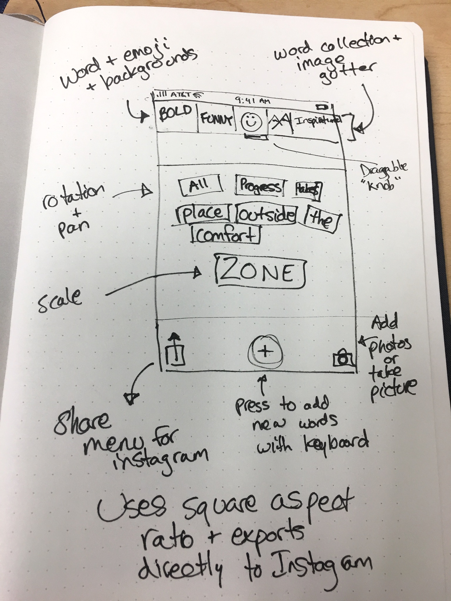
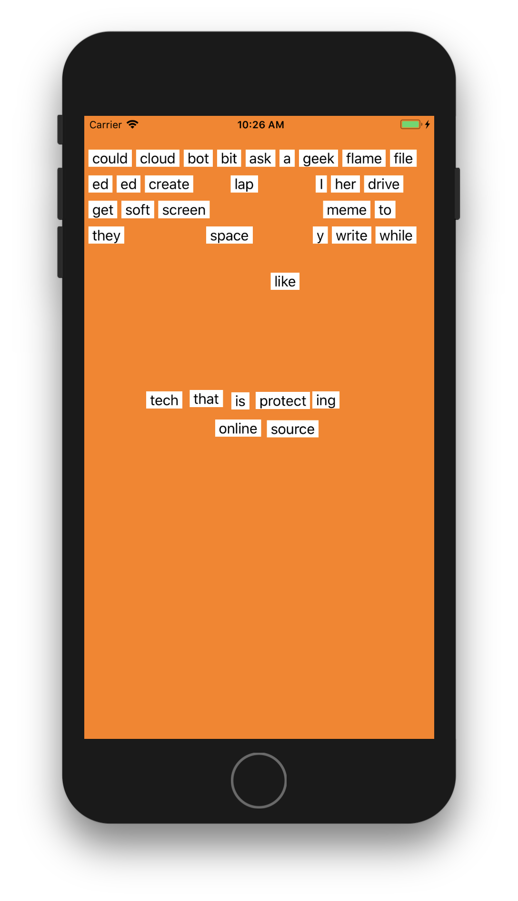

# Instagram Word Quotes
Paul Solt 

An interactive word based design app.

## Features (Proposed)

1. Feature 1: Create square sized word art for Instagram
2. Feature 2: Export directly to Instagram
3. Feature 3: Word/emoji/background collections in a draggable "gutter"

## Checkpoint 1 ##

### Initial Sketches ###

The goal is to polish the word magnet app so that we can create Instagram inspirational quotes (maybe even remix existing quotes from others).

User interaction with the pan gesture is working, in addition to positioning words in a ordered format along the top! It works as a universal app on iPhone/iPad.

### Current Features ###

1. Words can be dragged (no rotation or zoom)
2. Words reposition using the size of the label at the top

### Upcoming ###

Next checkpoint I'll start investigating Instagram's API to see if I can use it, or if it would be better to use the built-in share sheet. It doesn't save images yet, but we'll get it to start saving data too!
...

## Checkpoint 2 ##

...

# Required Structure #

1. Give your project a title (Use `#`) that makes your project sound unique, not a cookie cutter "Word Magnet" name.
2. Your names
3. Description (1-3 sentences)
4. 3 proposed features (based on what you or the class already brainstormed). Your features should help make your version unique, so you can stand out to employers.
5. Checkpoint Headings (Use `##`)
    1. Describe what you did (1-3 sentences)
    2. Show sketches and screenshots of the app running on iPhone or iPad (Command + Shift + 4 + Spacebar)
        1. Hold `Command` to focus on Simulator or press `Alt` to remove window shadow
    3. Add images to an images folder, and link to them, as this readme demonstrates
